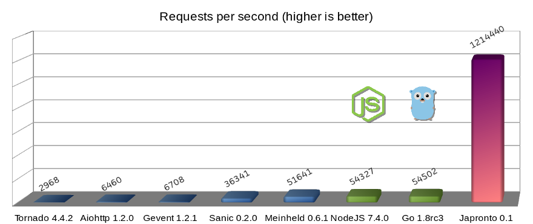

# Japronto!

Japronto (from Portuguese "já pronto" /ˈʒa pɾõtu/ meaning "already done") is a __screaming-fast__, __scalable__, __asynchronous__
Python 3.5+ web __micro-framework__ integrated with __pipelining HTTP server__
based on [uvloop](https://github.com/MagicStack/uvloop) and [picohttpparser](https://github.com/h2o/picohttpparser).

You can read more in the [release announcement on medium](https://medium.com/todo)

Performance
-----------

Here comes a chart to help you imagine what kind of things you can do with Japronto:



These results of a simple "Hello world" application were obtained on AWS c4.2xlarge instance. To be fair all the contestants (including Go) were running single worker process. Servers were load tested using [wrk](https://github.com/wg/wrk) with 1 thread, 100 connections and 24 simultaneous (pipelined) requests per connection.

The source code for the benchmark can be found in [benchmarks](benchmarks) directory.

The server is written in hand tweaked C trying to take advantage of modern CPUs. It relies on picohttpparser for header &
chunked-encoding parsing while uvloop provides asynchronous I/O. It also tries to save up on
system calls by combining writes together when possible.

Hello world
-----------

Here is how a simple web application looks like in Japronto:

```python
from japronto import Application


def hello(request):
    return request.Response(text='Hello world!')


app = Application()
app.router.add_route('/', hello)
app.run(debug=True)
```

Tutorial
--------

1. [Getting started](tutorial/1_hello.md)
2. [Asynchronous handlers](tutorial/2_async.md)
3. [Router](tutorial/3_router.md)
4. [Request object](tutorial/4_request.md)
5. [Response object](tutorial/5_response.md)
6. [Handling exceptions](tutorial/6_exceptions.md)
7. [Extending request](tutorial/7_extend.md)

Features
--------

- HTTP 1.x implementation with support for chunked uploads
- Full support for HTTP pipelining
- Keep-alive connections with configurable reaper
- Support for synchronous and asynchronous views
- Master-multiworker model based on forking
- Support for code reloading on changes
- Simple routing

License
-------

This software is distributed under [MIT License](https://en.wikipedia.org/wiki/MIT_License). This is a very permissive license that let's you use this software for any
commercial and non-commercial work. Full text of the license is
incuded in [LICENSE.txt](LICENSE.txt) file.

The source distribution of this software includes a copy of picohttpparser which is distributed under MIT license as well.
